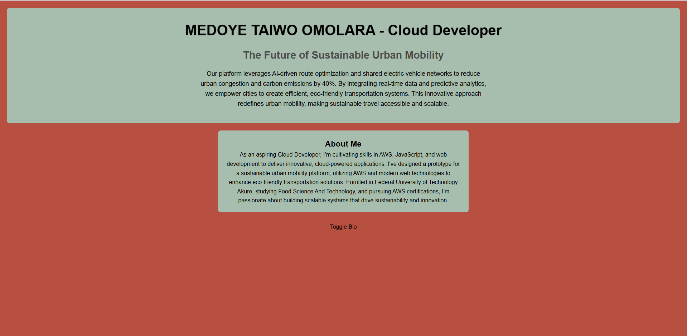

# Startup Prototype Landing Page

## Overview
This project is a landing page for the Cloud Developer role, showcasing "MEDOYE TAIWO OMOLARA - Cloud Developer". It is deployed on an AWS EC2 instance running Ubuntu 22.04 with Nginx as the web server. The page is accessible at [http://54.247.7.11](http://54.247.7.11) (redirects to HTTPS) and [https://54.247.7.11](https://54.247.7.11).

### Features
- **Title**: "MEDOYE TAIWO OMOLARA - Cloud Developer" with font scaling animation (color `#408EC6`).
- **Pitch**: "The Future of Sustainable Urban Mobility" with pulsing animation and bounce effect on click.
- **Bio**: Hidden by default, toggled with a button (background color `#7A2048`).
- **Styling**: CSS animations (color pulse, slide-in) with colors `#1E2761`, `#408EC6`, `#7A2048`.
- **Interactivity**: JavaScript for button toggle and bounce effect.
- **Files**: `index.html`, `styles.css`, `script.js`.

## Server Setup
1. **Launched EC2 Instance**:
   - AWS Console: Created an EC2 instance.
   - AMI: Ubuntu Server 22.04 LTS.
   - Instance type: t2.micro.
   - Key pair: `Eng.pem` (stored locally at `~/.ssh/Eng.pem`).
   - Security group: Configured inbound rules:
     - SSH: TCP 22, `0.0.0.0/0` (or my IP).
     - HTTP: TCP 80, `0.0.0.0/0`.
     - HTTPS: TCP 443, `0.0.0.0/0`.
   - Public IP: `54.247.7.11` (private IP: `172.31.33.70`).

2. **Connected to Instance**:
   ```bash
   chmod 400 ~/.ssh/Eng.pem
   ssh -i ~/.ssh/Eng.pem ubuntu@54.247.7.11


3. ## Deployment
- URL: [http://54.247.7.11](http://54.247.7.11) (redirects to HTTPS), [https://54.247.7.11](https://54.247.7.11)
- Files: index.html, styles.css, script.js
- Served from /var/www/html via Nginx.


## Screenshot

